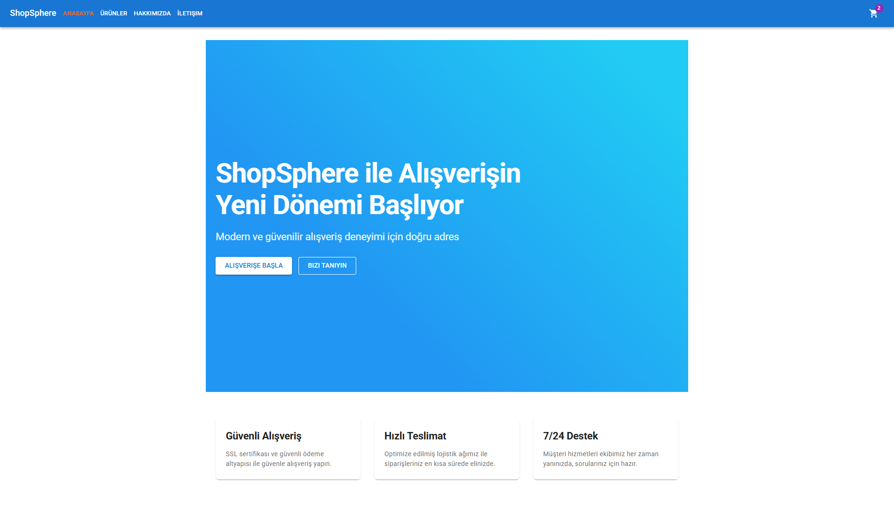
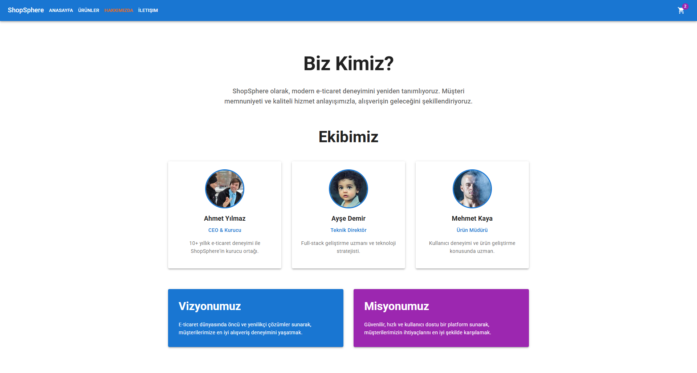
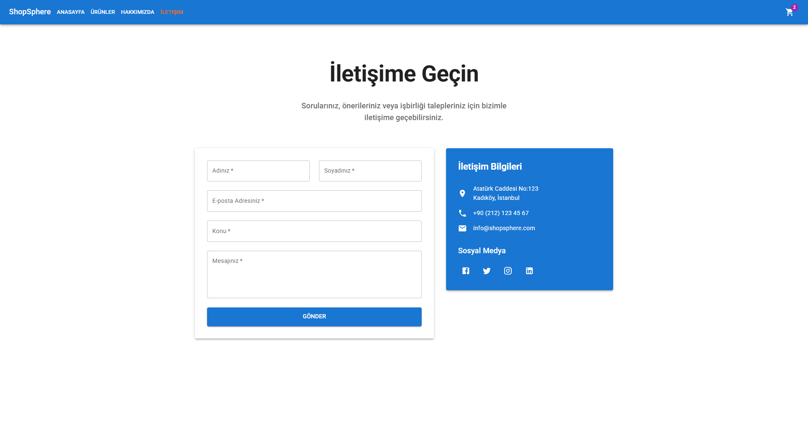
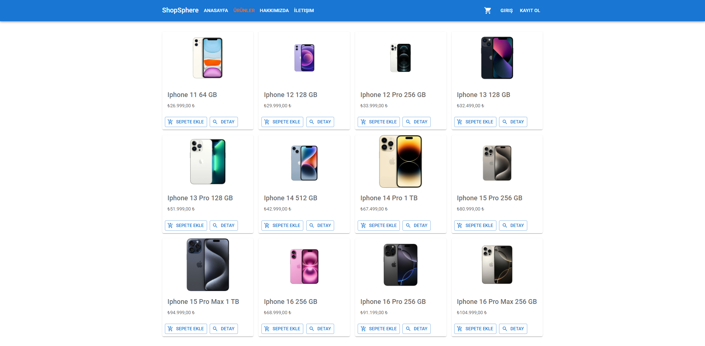
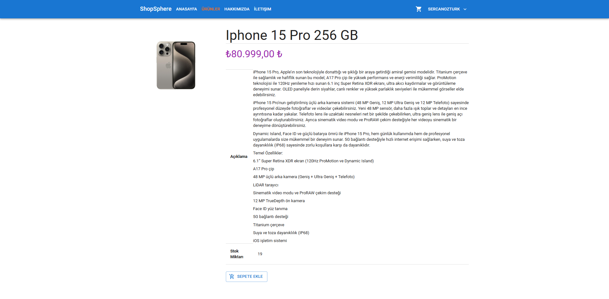
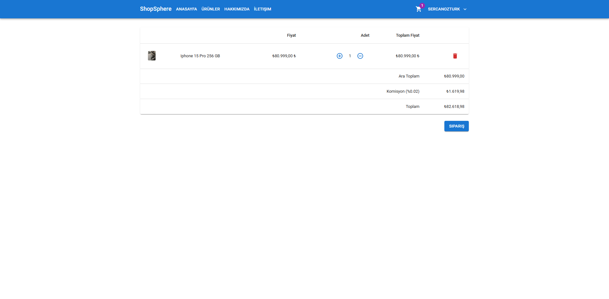
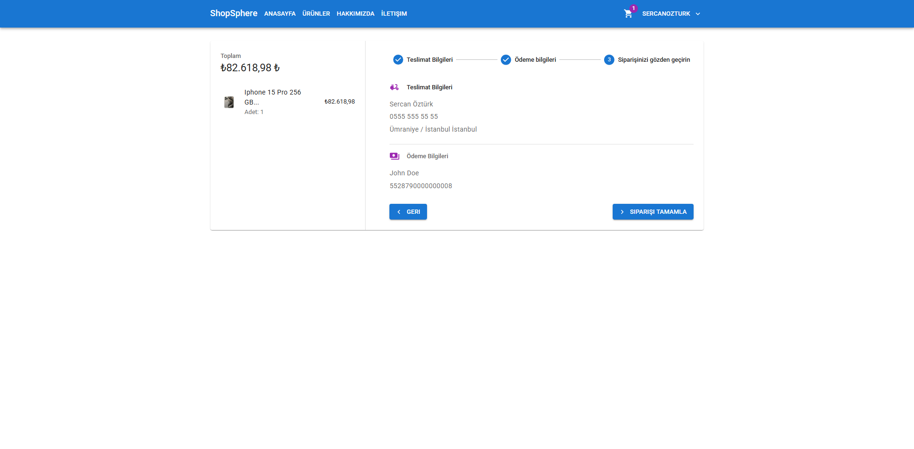
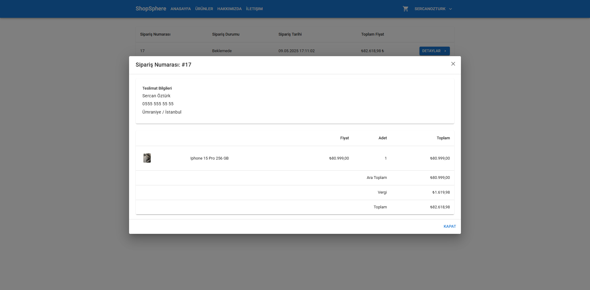

# ShopSphere E-Commerce Platform

ShopSphere is a modern e-commerce application developed using cutting-edge web technologies.

## 📸 Screenshots

### Home Page

Welcome users with a modern and impressive home page design. We offer a dynamic experience with gradient backgrounds and animated transitions.

### About Us

Introducing our team and vision with a modern design. We enhance the user experience with hover effects and smooth animations.

### Contact

Provide easy access to our customers with a user-friendly contact form and modern design.

### Products

Users can easily find the products they are looking for on a modern and filterable products page.

### Product Detail

The product detail page stylishly presents product information, descriptions, and user reviews.

### Basket

Users can easily view and manage the products they have added to their basket.

### Reviews

Users can leave reviews for products and view feedback from other customers.

### Order Detail

The order detail page allows users to view all information about their orders, including products, quantities, prices, and order status, in a clear and organized manner.

### Iyzico Integration
ShopSphere is fully integrated with the Iyzico payment infrastructure and payments can be securely processed.

## 🛠️ Technologies Used

### Backend
- .NET 9.0
- ASP.NET Core Web API
- Entity Framework Core
- SQL Server
- JWT (JSON Web Token) Authentication

### Frontend
- React.js 18
- TypeScript
- Material-UI (MUI v6)
- Framer Motion
- React Router v7
- Axios
- Formik
- Yup

## 🌟 Features

- Modern and responsive design
- Animated page transitions
- Material Design based UI
- Type safety with TypeScript
- SEO-friendly structure
- Secure payment infrastructure
- User-friendly interface
- Cross-browser compatibility

## 📱 Responsive Design

- Mobile-first design approach
- Compatible with all screen sizes
- Optimized for touch devices
- Fluid layouts and flexible images
- Adaptive navigation menus

## ⚡ Performance

- Optimized database queries
- Lazy loading implementation
- Image optimization
- Minified assets
- Caching strategies
- Fast page load times
