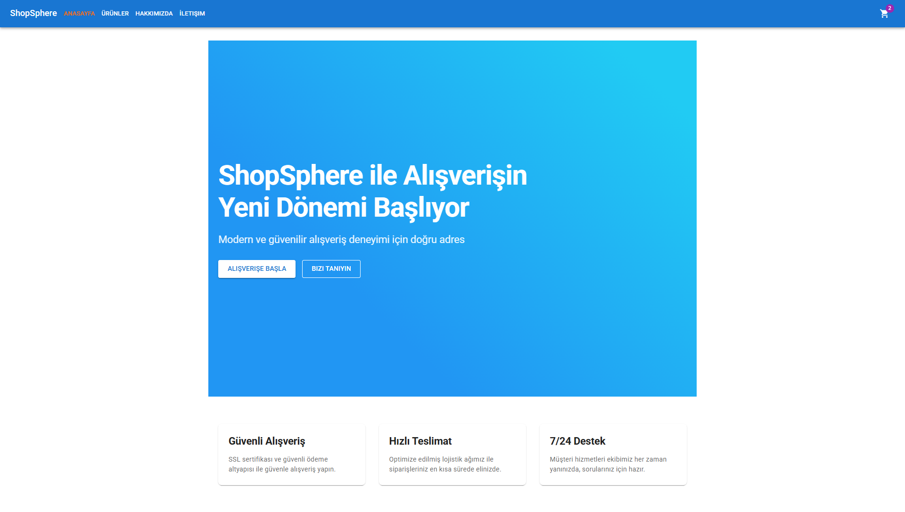
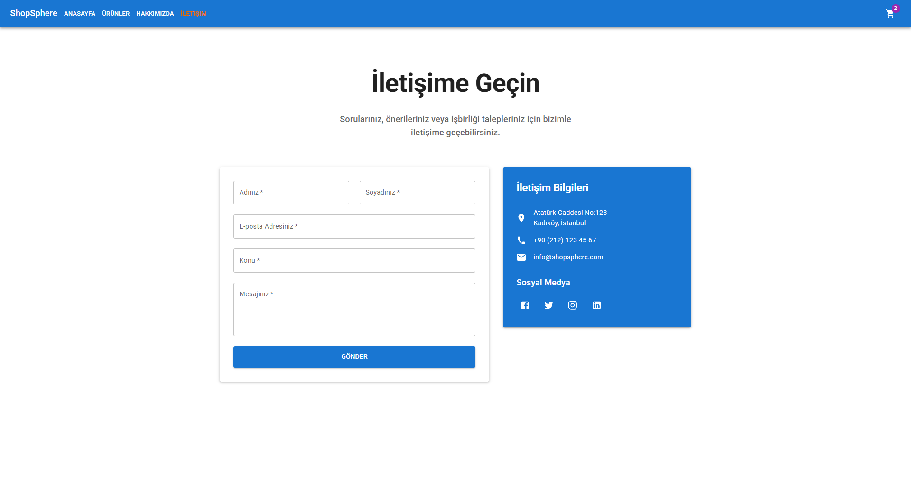

# ShopSphere E-Commerce Platform

ShopSphere is a modern e-commerce application developed using cutting-edge web technologies.

## 📸 Screenshots

### Home Page

Welcome users with a modern and impressive home page design. We offer a dynamic experience with gradient backgrounds and animated transitions.

### About Us

Introducing our team and vision with a modern design. We enhance the user experience with hover effects and smooth animations.

### Contact

Provide easy access to our customers with a user-friendly contact form and modern design.

## 🛠️ Technologies Used

### Backend
- .NET 9.0
- ASP.NET Core Web API
- Entity Framework Core
- SQL Server

### Frontend
- React.js 18
- TypeScript
- Material-UI (MUI v6)
- Framer Motion
- React Router v7

## 🌟 Features

- Modern and responsive design
- Animated page transitions
- Material Design based UI
- Type safety with TypeScript
- SEO-friendly structure
- Secure payment infrastructure
- User-friendly interface
- Cross-browser compatibility

## 🚀 Installation

1. For Backend:
```bash
cd ShopSphere.API
dotnet restore
dotnet run
```

2. For Frontend:
```bash
cd ShopSphereUI
npm install
npm run dev
```

## 📱 Responsive Design

- Mobile-first design approach
- Compatible with all screen sizes
- Optimized for touch devices
- Fluid layouts and flexible images
- Adaptive navigation menus

## 🔒 Security

- SSL certificate implementation
- Secure payment gateway integration
- GDPR compliant data handling
- Protected API endpoints
- Input validation and sanitization
- XSS and CSRF protection

## ⚡ Performance

- Optimized database queries
- Lazy loading implementation
- Image optimization
- Minified assets
- Caching strategies
- Fast page load times

## 📞 Contact

For questions and suggestions:
- 📧 Email: info@shopsphere.com
- 📱 Phone: +90 (212) 123 45 67
- 📍 Address: Ataturk Street No:123, Kadikoy, Istanbul

## 🤝 Contributing

1. Fork the project
2. Create your feature branch (`git checkout -b feature/AmazingFeature`)
3. Commit your changes (`git commit -m 'Add some AmazingFeature'`)
4. Push to the branch (`git push origin feature/AmazingFeature`)
5. Open a Pull Request

## License

This project is licensed under the MIT License - see the `LICENSE.txt` file for details.

## Acknowledgments

- Material-UI for the amazing component library
- React.js community for continuous support
- All contributors who have helped with the project 